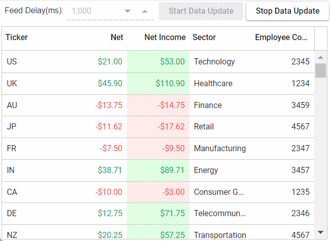

# Implementing real-time updates in Syncfusion Grid
This article delves into the intricacies of implementing live data updates within the Syncfusion React Grid. This comprehensive guide explores how developers can seamlessly integrate real-time data feeds into their applications to ensure that grid displays are always up-to-date with the latest information. From establishing connections to data sources to configuring automatic refresh mechanisms, this blog covers everything developers need to know to create dynamic and responsive grids. With step-by-step instructions and code samples, developers can learn how to leverage Syncfusion's powerful features to build applications that deliver real-time insights and enhance user experiences.

## Where the live data is used?
"Live data" refers to updated data in real-time, providing users with the most current information available. This type of data is commonly used in various - applications where up-to-date information is critical, such as
- Financial dashboards / Stock market tracking - Live data allows users to monitor stock prices, currency exchange rates, and market trends as they happen. This enables traders and investors to make informed decisions based on the latest market conditions.
- Real-time monitoring systems - In real-time monitoring systems, live data is used to track various metrics and events in industries such as manufacturing, healthcare, and transportation
- Collaborative editing platforms - Like Google Docs, rely on live data to enable multiple users to edit documents simultaneously. Changes made by one user are instantly reflected by others, ensuring that everyone has access to the most current version of the document.
  
Overall, live data enhances user experiences by providing timely and relevant information, leading to better decision-making and increased productivity.

## Run the sample
To run the application, execute the following commands:
- npm i
- npm start
